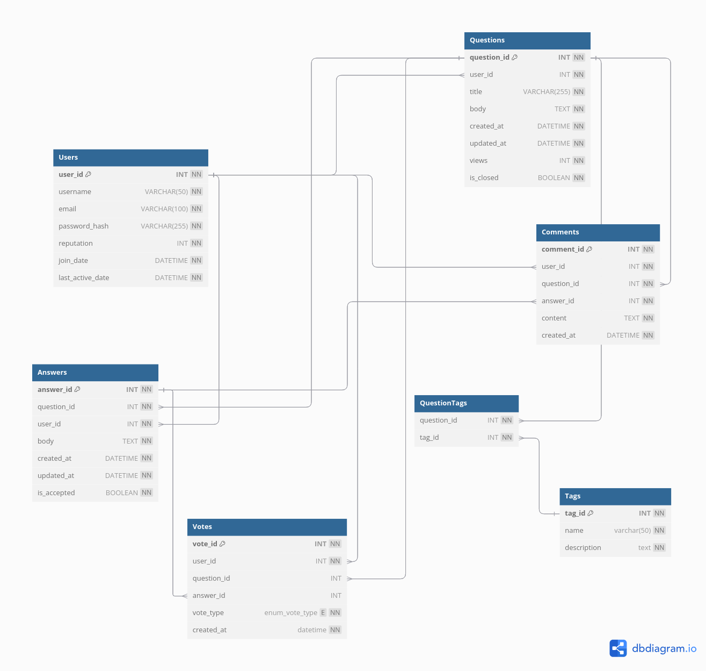

# Database Schema

Relationships
 - Users → Questions: One-to-Many (A user can ask multiple questions).
 - Users → Answers: One-to-Many (A user can provide multiple answers).
 - Users → Comments: One-to-Many (A user can post multiple comments).
 - Users → Votes: One-to-Many (A user can cast multiple votes).
 - Questions → Answers: One-to-Many (A question can have multiple answers).
 - Questions → Comments: One-to-Many (A question can have multiple comments).
 - Answers → Comments: One-to-Many (An answer can have multiple comments).
 - Questions → Tags: Many-to-Many via QuestionTags.

